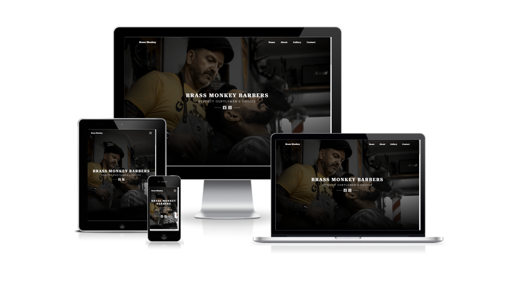

# Brass Monkey Barbers | PORTFOLIO PROJECT 1
Brass Monkey Barbers is the first Project for Code Institute. The website is designes to be responsive allowing visisitors to view and interact with the website on different type and size of devices. The purpose of the website is to add marketing, awareness and relative information about the business to the public, targeting to attract younger generation that loves classic style hair cuts.

[View live website here.](https://eambrozas.github.io/brass-monkey-barbers/)

## User Experience (UX)
___
### User stories
<ul>
    <li>First Time Visitors Goals
        <ul>
            <li>As a First time visitor, I want to easily understand the main purpose of the site and learn more about the organisation.</li>
            <li>As a First Time Visitor, I want to be able to easily navigate throughout the site to find content.</li>
            <li>As a First Time Visitor, I want to be able to check their social media.</li>
            <li>As a First Time Visitor, I want to have a way to view their reviews to determine how trusted they are.</li>
        </ul>
    </li>
</ul>
 
<ul>
    <li>Returning Visitors Goals
        <ul>
            <li>As a Returning Visitor, I want to be able to see their work.</li>
            <li>As a Returning Visitor, I want to be able to see their opening times.</li>
            <li>As a Returning Visitor, I want to find a way to get in contact with the organisation.</li>
            <li>As a Returning Visitor, I want to know where is the organisation located.</li>
        </ul>    
    </li>
</ul>
 

### Design Features ideas based on the user needs
>As a First time visitor, I want to easily understand the main purpose of the site and learn more about the organisation.

<ul>
    <li>Hero section will contain the organisations name and ethos with an eye caching background image that relates to the organisation services.</li>
    <li>About section will have more eye caching image and provide relative information on what the organisation is all about and services they provide.</li>
</ul>
 

>As a First Time Visitor, I want to be able to easily navigate throughout the site to find content.

<ul>
    <li>At the top of the page the website will containt a navigation menu with the links provided for each section of the site. On smaller screens the users will be provided with a mobile hamburger menu that will display links for each section on click of the hamburger icon.</li>
</ul>
 

>As a First Time Visitor, I want to be able to check their social media.

<ul>
    <li>Social icon links will be provided at the hero and contact sections.</li>
</ul>
 

>As a First Time Visitor, I want to have a way to view their reviews to determine how trusted they are.

<ul>
    <li>The users will be provided with a link to google reviews page of the organisation at the contact section that will open up on a new page.</li>
    <li>The decision to provide a link to google reviews and not adding a separate section with reviews on the website is the fact that most users are already familiar with google reviews which will add more trust and also will simplify the design of the site.</li>
</ul>
 

>As a Returning Visitor, I want to be able to see their work.

<ul>
    <li>Gallery section will provide the user with images of haircut's that is responsive on all screen sizes and have an eye caching zoom in effect when hovered on to.</li>
</ul>
 

>As a Returning Visitor, I want to be able to see their opening times.

<ul>
    <li>The users will be provided with nicely styled time table of the opening hours of the organisaction.</li>
</ul>
 

>As a Returning Visitor, I want to find a way to get in contact with the organisation.

<ul>
    <li>Contact Section will provide the user with a number of contact options with the main option beeing a form that the user could fill out and secondary will be social links to Facebook and Instagram.</li>
</ul>
 

>As a Returning Visitor, I want to know where is the organisation located.

<ul>
    <li>The website will have an imbedded map that the user could zoom in or zoom out on to view organistions location.</li>
</ul>
 

### Structure bases on feature ideas
<ul>
    <li>Website layout
    <ul>
    <li>Home
        <ul>
            <li>Navigation menu that is responsive on all devices and screen sizes.</li>
            <li>Header wight the name of the organisation and its ethos.</li>
            <li>Social media icon links.</li>
        </ul>
    </li>
    <li>About
        <ul>
            <li>Opening times.</li>
            <li>Convay company ethos.</li>
            <li>Provide the user with information of services.</li>
        </ul>
    </li>
    <li>Gallery
            <ul>
            <li>Add images of haircuts that are responsive on all screen sizes and have an eye ceching zoom in effect when hovered on to.</li>
        </ul>
    </li>
    <li>Contact
        <ul>
            <li>Imbedded map</li>
            <li>Form</li>
            <li>Add the address of the bussines with links to social media and google reviews.</li>
        </ul>
    </li>
</ul>
    </li>
</ul>
 

### Design
 

#### Typography
Roboto Serif font was used on all text elements throughout the page for consistency and complimented well with a classic design look of the website. Serif font was used as a backup if for any reason the main font would not load.
 
 

#### Colour Scheme
The two main colours used were whitesmoke and black to give the website a simple, classic look and also giving the highest contrast possible between the background color and text making it easier to read the information provided on the website.
 
 

#### Imagery
Most images were made by my self for Brass Monkey Barbers