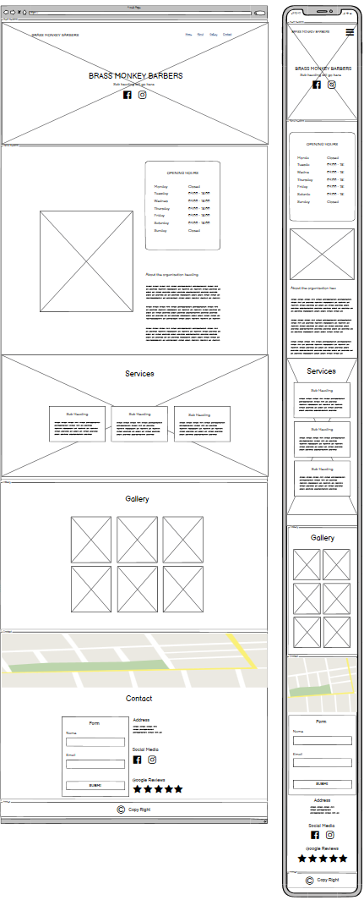
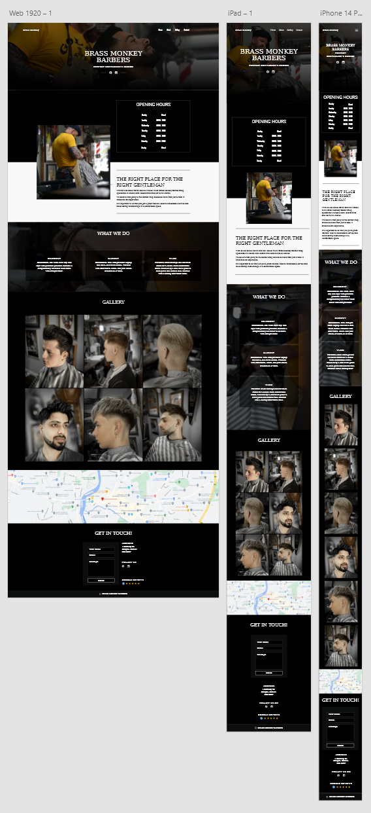

# Brass Monkey Barbers | PORTFOLIO PROJECT 1
Brass Monkey Barbers is the first Project for Code Institute. The website is designed to be responsive allowing visisitors to view and interact with the website on different type and size of devices. The purpose of the website is to add marketing, awareness and relative information about the business to the public, targeting to attract younger generation that loves classic style hair cuts.

[View live website here.](https://eambrozas.github.io/brass-monkey-barbers/)

## Table of Contents
___

- [User Experience (UX)](#user-experience)
    - [User stories](#user-stories)
        - [First Time Visitors Goals](#first-time)
        - [Returning Visitors Goals](#returning)
    - [Features](#features)
    - [Structure](#structure)
        - [Home](#home)
        - [About](#about)
        - [Gallery](#gallery)
        - [Contact](#contact)
    - [Design](#design)
        - [Typography](#typography)
        - [Colour Scheme](#color)
        - [Imagery](#imagery)
    - [Wireframes](#wireframes)
    - [Adobe XD Design](#adobe-design)
- [Features](#features)
- [Teschnologies](#technologies)
    - [Languages Used](#languages)
    - [Frameworks, Libraries & Programs Used](#flp)
- [Deployment](#deployment)
    - [Project Creation](#project-creation)
    - [Start Project in Gitpod](#start-project)
    - [Run Project Live Preview](#live-preview)
    - [GitHub Pages](#github-pages)
    - [Git commands](#git-commands)
- [Credits](#credits)
    - [Layout](#layout)
    - [Media](#media)
    - [Content](#content)
    - [Code](#code)

## User Experience (UX)
___

### User Stories

 
<ul>
    <li id="first-time">First Time Visitors Goals
        <ul>
            <li>As a First time visitor, I want to easily understand the main purpose of the site and learn more about the organisation.</li>
            <li>As a First Time Visitor, I want to be able to easily navigate throughout the site to find content.</li>
            <li>As a First Time Visitor, I want to be able to check their social media.</li>
            <li>As a First Time Visitor, I want to have a way to view their reviews to determine how trusted they are.</li>
        </ul>
    </li>
</ul>
 
<ul>
    <li id="returning">Returning Visitors Goals
        <ul>
            <li>As a Returning Visitor, I want to be able to see their work.</li>
            <li>As a Returning Visitor, I want to be able to see their opening times.</li>
            <li>As a Returning Visitor, I want to find a way to get in contact with the organisation.</li>
            <li>As a Returning Visitor, I want to know where is the organisation located.</li>
        </ul>    
    </li>
</ul>
 

### Features

 
 

>As a First time visitor, I want to easily understand the main purpose of the site and learn more about the organisation.

<ul>
    <li>Hero section will contain the organisations name and ethos with an eye caching background image that relates to the organisation services.</li>
    <li>About section will have more eye caching image and provide relative information on what the organisation is all about and services they provide.</li>
</ul>
 

>As a First Time Visitor, I want to be able to easily navigate throughout the site to find content.

<ul>
    <li>At the top of the page the website will containt a navigation menu with the links provided for each section of the site. On smaller screens the users will be provided with a mobile hamburger menu that will display links for each section on click of the hamburger icon.</li>
</ul>
 

>As a First Time Visitor, I want to be able to check their social media.

<ul>
    <li>Social icon links will be provided at the hero and contact sections.</li>
</ul>
 

>As a First Time Visitor, I want to have a way to view their reviews to determine how trusted they are.

<ul>
    <li>The users will be provided with a link to google reviews page of the organisation at the contact section that will open up on a new page.</li>
    <li>The decision to provide a link to google reviews and not adding a separate section with reviews on the website is the fact that most users are already familiar with google reviews which will add more trust and also will simplify the design of the site.</li>
</ul>
 

>As a Returning Visitor, I want to be able to see their work.

<ul>
    <li>Gallery section will provide the user with images of haircut's that is responsive on all screen sizes and have an eye caching zoom in effect when hovered on to.</li>
</ul>
 

>As a Returning Visitor, I want to be able to see their opening times.

<ul>
    <li>The users will be provided with nicely styled time table of the opening hours of the organisaction.</li>
</ul>
 

>As a Returning Visitor, I want to find a way to get in contact with the organisation.

<ul>
    <li>Contact Section will provide the user with a number of contact options with the main option beeing a form that the user could fill out and secondary will be social links to Facebook and Instagram.</li>
</ul>
 

>As a Returning Visitor, I want to know where is the organisation located.

<ul>
    <li>The website will have an imbedded map that the user could zoom in or zoom out on to view organistions location.</li>
</ul>
 

### Structure

 
    <ul>
    <li id="home">Home
        <ul>
            <li>Navigation menu that is responsive on all devices and screen sizes.</li>
            <li>Header wight the name of the organisation and its ethos.</li>
            <li>Social media icon links.</li>
        </ul>
    </li>
    <li id="about">About
        <ul>
            <li>Opening times.</li>
            <li>Convay company ethos.</li>
            <li>Provide the user with information of services.</li>
        </ul>
    </li>
    <li id="gallery">Gallery
            <ul>
            <li>Add images of haircuts that are responsive on all screen sizes and have an eye catching zoom in effect when hovered on to.</li>
        </ul>
    </li>
    <li id="contact">Contact
        <ul>
            <li>Imbedded map.</li>
            <li>Form.</li>
            <li>Add the address of the bussines with links to social media and google reviews.</li>
        </ul>
    </li>
</ul>
 

### Design

 
<ul>
    <li id="typography">Typography
    <ul>
        <li>Roboto Serif font is used on all text elements throughout the page complimenting well with a classic design look of the website. Serif is used as a fallback font if for any reason the main font would not load.</li>
    </ul>
    </li>
    <li id="color">Colour Scheme
    <ul>
        <li>The two main colours used are whitesmoke and black to give the website a simple, classic look and also giving the highest contrast possible between the background color and text making it easier to read the information provided on the website.</li>
    </ul>
    </li>
    <li id="imagery"> Imagery
    <ul>
        <li>Imagery is important. All images in each section of the website are designed to be striking, catch the user's attention and help break up the text on the site improving user experience. Images have been taken for this project at Brass Monkey Barbers. Each image is edited in Adobe Lightroom to give them an older classic look and resized in Adobe Photoshop for a specific section.</li>
    </ul>
    </li>
</ul>

### Wireframes

### Adobe XD Design

## Features
___

<ul>
    <li>The website ir responsive on all devices and screen sizes.</li>
    <li>Interactive elements such as links, buttons and social media icons.</li>
    <li>Interactive gallery images that zoom in on mouse hover.</li>
    <li>Hamburger menu for mobile devices that display or hide mobile navigation menu on a click.</li>
    <li>Embedded map.</li>
    <li>Contact form.</li>       
</ul>
 

## Technologies
___

### Languages Used

 
<ul>
    <li><a href="https://en.wikipedia.org/wiki/HTML">HTML5</a></li>
    <li><a href="https://en.wikipedia.org/wiki/CSS">CSS3</a></li>
    <li><a href="https://en.wikipedia.org/wiki/JavaScript">JavaScript</a></li>
</ul>
 

### Frameworks, Libraries & Programs Used

 
<ul>
    <li><a href="https://fonts.google.com/">Google Fonts</a>
        <ul>
            <li>Google fonts were used to import the 'Roboto Serif' font into the style.css file which is used on all pages throughout the project.</li>
        </ul>
    </li>
</ul>
<ul>
    <li><a href="https://fontawesome.com/">Font Awesome</a>
        <ul>
            <li>Font Awesome was used for social links in main hero and contact sections.</li>
        </ul>
    </li>
</ul>
<ul>
    <li><a href="https://git-scm.com/">Git</a>
        <ul>
            <li>Git was used for version control by utilizing the Gitpod terminal to commit to Git and Push to GitHub.</li>
        </ul>
    </li>
</ul>
<ul>
    <li><a href="https://github.com/">GitHub</a>
        <ul>
            <li>GitHub is used to store the projects code after being pushed from Git.</li>
        </ul>
    </li>
</ul>
<ul>
    <li><a href="https://www.adobe.com/ie/products/photoshop-lightroom.html?gclid=Cj0KCQjwnvOaBhDTARIsAJf8eVOjH4dPSEF5YUvt-cy_GQOAe-YZNeQC-b-f9an8MbE2ZYIu9-4XgyEaAsQaEALw_wcB&mv=search&mv=search&sdid=L7NVTQ8Y&ef_id=Cj0KCQjwnvOaBhDTARIsAJf8eVOjH4dPSEF5YUvt-cy_GQOAe-YZNeQC-b-f9an8MbE2ZYIu9-4XgyEaAsQaEALw_wcB:G:s&s_kwcid=AL!3085!3!547896439650!e!!g!!adobe%20lightroom!1423511177!58810487274">Adobe Lightroom</a>
        <ul>
            <li>Adobe Lightroom was used to add color preset for all photos.</li>
        </ul>
    </li>
</ul>
<ul>
    <li><a href="https://www.adobe.com/ie/products/photoshop.html?gclid=Cj0KCQjwnvOaBhDTARIsAJf8eVO3rRHxJnLt7dFLsz9rBsMrQoVGoDK5svXE0qzu0eMgLEzLGhT-dPgaAofzEALw_wcB&mv=search&mv=search&sdid=LZ32SYVR&ef_id=Cj0KCQjwnvOaBhDTARIsAJf8eVO3rRHxJnLt7dFLsz9rBsMrQoVGoDK5svXE0qzu0eMgLEzLGhT-dPgaAofzEALw_wcB:G:s&s_kwcid=AL!3085!3!441704131147!e!!g!!adobe%20photoshop!1423511192!58810496314">Adobe Photoshop</a>
        <ul>
            <li>Adobe Photoshop was used to resize all the images.</li>
        </ul>
    </li>
</ul>
<ul>
    <li><a href="https://balsamiq.com/">Balsamiq</a>
        <ul>
            <li>Balsamiq was used to create the wireframes during the design process.</li>
        </ul>
    </li>
</ul>
<ul>
    <li><a href="https://www.adobe.com/uk/products/xd.html">Adobe XD</a>
        <ul>
            <li>Adobe XD was used to create the prototype of the website.</li>
        </ul>
    </li>
</ul>
<ul>
    <li><a href="https://www.gitpod.io/">Gitpod</a>
        <ul>
            <li>Gitpod text editor was used to develop the website.</li>
        </ul>
    </li>
</ul>

## Deployment
___

### Project Creation

<ul>
    <li>
    I used <a href="https://github.com/Code-Institute-Org/gitpod-full-template">Code Institute Template</a> to start the project by clicking on a 'Use this template' button. I gave it a repository name 'brass-monkey-barbers', checked the Include all branches checkbox and clicked on a green button called 'Create repository from template' to create repository.
    </li>
</ul>
 

### Start Project in Gitpod

<ol>
    <li>Navigate to the Github <a href="https://github.com/EAmbrozas/brass-monkey-barbers">repository</a>.</li>
    <li>Clik green 'Gitpod' button.</li>
</ol>
 

### Run Project Live Preview

<ol>
    <li>
        Open the project in Gitpod.
    </li>
    <li>
        Add 'python3 -m http.server' command in terminal.
    </li>
    <li>
        Click 'open preview' button to view the project with in Gitpod text editor or click 'open browser' button to view project in browser.
    </li>
</ol>
 

### GitHub Pages

<ol>
    <li>
        Navigate to <a href="https://github.com/EAmbrozas/brass-monkey-barbers">GitHub</a> repository.
    </li>
    <li>
        Go to Settings > Pages.
    </li>
    <li>
        Select main branche as the source.
    </li>
    <li>
        Click 'save' button.
    </li>
    <li>
        Click the 'Visit site' button to open up deployed website.
    </li>
</ol>
 

### Git commands

<ul>
    <li>
        git status - displays the state of the working directory and the staging area.
    </li>
    <li>
        git add . - adds a change in the working directory to the staging area.
    </li>
    <li>
        git commit -m "Commit message" - used to save changes to the local repository.
    </li>
    <li>
        git push - upload local repository content to a remote repository.
    </li>
</ul>
 

## Credits
___

<ul>
    <li id="layout">Layout
        <ul>
            <li>I was inspired by a barber shop theme on <a href="https://www.etsy.com/ie/listing/1172365331/barbar-barber-house-divi-child-theme?gpla=1&gao=1&&utm_source=google&utm_medium=cpc&utm_campaign=shopping_ie_en_ie_-paper_and_party_supplies-paper&utm_custom1=_k_Cj0KCQjwwfiaBhC7ARIsAGvcPe7bzFuUjiDoQphhW3sXfchBnmDQt9kpodrC3FhpdfPXkUQElGEW7GwaAlooEALw_wcB_k_&utm_content=go_13703308007_123455828599_530490400750_pla-314261241307_c__1172365331enie_432418375&utm_custom2=13703308007&gclid=Cj0KCQjwwfiaBhC7ARIsAGvcPe7bzFuUjiDoQphhW3sXfchBnmDQt9kpodrC3FhpdfPXkUQElGEW7GwaAlooEALw_wcB">etsy</a>. I redesigned the theme using <a href="https://balsamiq.com/">Balsamiq</a> and <a href="https://www.adobe.com/ie/products/xd.html">Adobe XD</a> to suit Brass Monkey Barbers</li>
        </ul>
    </li>
</ul>
<ul>
    <li id="media">Media
        <ul>
            <li>All images were taken by Ernestas Ambrozas upon request of Brass Monkey Barbers.</li>
        </ul>
    </li>
</ul>
 
<ul>
    <li id="content">Content
        <ul>
            <li>The content was created by Ernestas Ambrozas upon the discussion with Denis Healy at Brass Monkey Barbers.</li>
        </ul>
    </li>
</ul>
 
<ul>
    <li id="code">Code
        <ul>
            <li>I have learned on how to add hamburger menu for mobile navigation links at <a href="https://www.w3schools.com/howto/tryit.asp?filename=tryhow_js_mobile_navbar">w3schools</a>.</li>
            <li>The form button was taken from <a href="https://uiverse.io/detail/cssbuttons-io/brown-otter-21">universe</a> and slightly changed to mach the website design.</li>
        </ul>
    </li>
</ul>

### Acknowledgements
<ul>
    <li>A big thanks to my Mentor Ronan for valuable feedback.</li>
    <li>My Cohort lead Kasia for support.</li>
</ul>